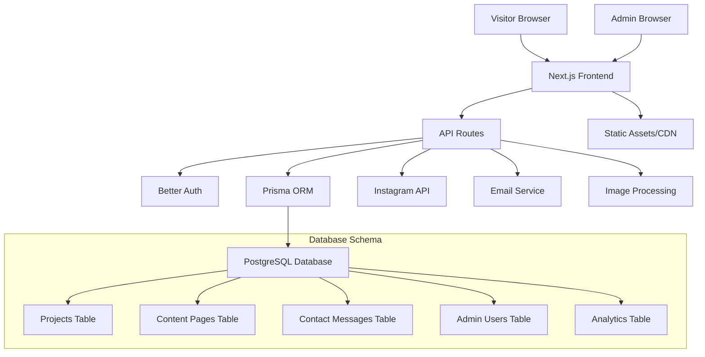

# Design Document

## Overview

The Portfolio CMS will transform the existing Next.js authentication system into a comprehensive portfolio website with Instagram integration, multilingual support, and GDPR compliance. The system maintains a minimal black-on-white aesthetic while providing robust content management capabilities for artisan businesses.

### Technology Stack

- **Frontend**: Next.js 16 with React 19, TypeScript, Tailwind CSS 4
- **Backend**: Next.js API routes with Better Auth v1.3
- **Database**: PostgreSQL with Prisma ORM
- **Authentication**: Better Auth with email/password
- **Styling**: Tailwind CSS with minimal black-on-white theme
- **Image Processing**: Next.js Image optimization + custom compression
- **Internationalization**: Next.js i18n with Dutch/French support

## Architecture

### System Architecture



### Folder Structure

```
src/
├── app/                          # Next.js App Router
│   ├── (public)/                 # Public routes group
│   │   ├── page.tsx              # Homepage
│   │   ├── projects/             # Project gallery
│   │   ├── about/                # About page
│   │   ├── contact/              # Contact page
│   │   └── privacy/              # Privacy policy
│   ├── admin/                    # Admin routes (protected)
│   │   ├── layout.tsx            # Admin layout with auth
│   │   ├── dashboard/            # Admin dashboard
│   │   ├── projects/             # Project management
│   │   ├── content/              # Content management
│   │   ├── messages/             # Contact messages
│   │   └── analytics/            # Analytics dashboard
│   ├── api/                      # API routes
│   │   ├── auth/                 # Better Auth endpoints
│   │   ├── projects/             # Project CRUD
│   │   ├── content/              # Content management
│   │   ├── contact/              # Contact form handling
│   │   ├── instagram/            # Instagram integration
│   │   └── upload/               # Image upload handling
│   ├── globals.css               # Tailwind CSS imports
│   └── layout.tsx                # Root layout
├── components/                   # Reusable components
│   ├── ui/                       # Base UI components
│   ├── forms/                    # Form components
│   ├── gallery/                  # Gallery components
│   ├── admin/                    # Admin-specific components
│   └── layout/                   # Layout components
├── lib/                          # Utility libraries
│   ├── auth.ts                   # Better Auth configuration
│   ├── db.ts                     # Prisma client
│   ├── instagram.ts              # Instagram API integration
│   ├── email.ts                  # Email service
│   ├── image-processing.ts       # Image optimization
│   └── analytics.ts              # Analytics utilities
├── types/                        # TypeScript type definitions
├── locales/                      # Translation files
│   ├── nl.json                   # Dutch translations (default)
│   └── fr.json                   # French translations
└── prisma/                       # Database schema and migrations
    ├── schema.prisma
    └── migrations/
```

### Database Schema (Prisma)

Building on the existing User, Account, Session, and Verification models:

```prisma
model Project {
  id           String                @id @default(cuid())
  contentTypeId String
  contentType  ContentType           @relation(fields: [contentTypeId], references: [id])
  featured     Boolean               @default(false)
  published    Boolean               @default(true)
  images       ProjectImage[]
  translations ProjectTranslation[]
  createdBy    String
  creator      User                  @relation(fields: [createdBy], references: [id])
  createdAt    DateTime              @default(now())
  updatedAt    DateTime              @updatedAt
}

model ProjectTranslation {
  id          String   @id @default(cuid())
  projectId   String
  project     Project  @relation(fields: [projectId], references: [id], onDelete: Cascade)
  languageId  String
  language    Language @relation(fields: [languageId], references: [id])
  title       String
  description Json     // TipTap JSON content
  materials   String[]
  
  @@unique([projectId, languageId])
}

model ProjectImage {
  id           String  @id @default(cuid())
  projectId    String
  project      Project @relation(fields: [projectId], references: [id], onDelete: Cascade)
  originalUrl  String
  thumbnailUrl String
  alt          String
  order        Int     @default(0)
  createdAt    DateTime @default(now())
}

model ContentPage {
  id           String                   @id @default(cuid())
  slug         String                   @unique
  published    Boolean                  @default(true)
  translations ContentPageTranslation[]
  updatedAt    DateTime                 @updatedAt
}

model ContentPageTranslation {
  id          String      @id @default(cuid())
  pageId      String
  page        ContentPage @relation(fields: [pageId], references: [id], onDelete: Cascade)
  languageId  String
  language    Language    @relation(fields: [languageId], references: [id])
  title       String
  content     Json        // TipTap JSON content
  
  @@unique([pageId, languageId])
}

model ContactMessage {
  id          String   @id @default(cuid())
  name        String
  email       String
  projectType String
  message     String
  read        Boolean  @default(false)
  replied     Boolean  @default(false)
  createdAt   DateTime @default(now())
}

model InstagramPost {
  id          String   @id @default(cuid())
  instagramId String   @unique
  imageUrl    String
  caption     String
  postedAt    DateTime
  syncedAt    DateTime @default(now())
  isActive    Boolean  @default(true)
}

model CookieConsent {
  id          String   @id @default(cuid())
  sessionId   String   @unique
  essential   Boolean  @default(true)
  analytics   Boolean  @default(false)
  marketing   Boolean  @default(false)
  createdAt   DateTime @default(now())
  updatedAt   DateTime @updatedAt
}

model UserPreferences {
  id          String   @id @default(cuid())
  sessionId   String   @unique
  language    String   @default("nl") // Dynamic based on available languages
  createdAt   DateTime @default(now())
  updatedAt   DateTime @updatedAt
}

model UserRole {
  id          String @id @default(cuid())
  userId      String
  user        User   @relation(fields: [userId], references: [id], onDelete: Cascade)
  role        String // 'admin', 'editor', 'viewer'
  permissions Json   // Granular permissions object
  createdAt   DateTime @default(now())
  updatedAt   DateTime @updatedAt
  
  @@unique([userId])
}

model SiteSettings {
  id          String   @id @default(cuid())
  key         String   @unique
  value       Json
  category    String   // 'languages', 'theme', 'content_types', 'social'
  description String?
  updatedAt   DateTime @updatedAt
}

model Language {
  id          String   @id @default(cuid())
  code        String   @unique // 'nl', 'fr', 'en', 'de'
  name        String   // 'Nederlands', 'Français', 'English', 'Deutsch'
  isDefault   Boolean  @default(false)
  isActive    Boolean  @default(true)
  createdAt   DateTime @default(now())
  updatedAt   DateTime @updatedAt
}

model ContentType {
  id          String   @id @default(cuid())
  name        String   @unique // 'projects', 'services', 'products'
  displayName String   // 'Projects', 'Services', 'Products'
  fields      Json     // Dynamic field definitions
  isActive    Boolean  @default(true)
  createdAt   DateTime @default(now())
  updatedAt   DateTime @updatedAt
}

model SocialIntegration {
  id          String   @id @default(cuid())
  platform    String   @unique // 'instagram', 'facebook', 'twitter'
  displayName String   // 'Instagram', 'Facebook', 'Twitter'
  config      Json     // Platform-specific configuration
  isActive    Boolean  @default(false)
  createdAt   DateTime @default(now())
  updatedAt   DateTime @updatedAt
}
```

## Components and Interfaces

### Public Website Components

#### 1. Portfolio Gallery (`/src/components/portfolio/`)
- **ProjectGrid**: Masonry layout with lazy loading
- **ProjectModal**: Detailed project view with image carousel
- **ProjectCard**: Individual project preview with hover effects

#### 2. Instagram Integration (`/src/components/instagram/`)
- **InstagramFeed**: Displays recent posts in unified feed
- **InstagramPost**: Individual post component with fallback handling

#### 3. Contact System (`/src/components/contact/`)
- **ContactForm**: Validated form with multilingual support
- **ContactInfo**: Display alternative contact methods

#### 4. Layout Components (`/src/components/layout/`)
- **Header**: Navigation with language toggle
- **Footer**: Minimal footer with privacy links
- **CookieBanner**: GDPR-compliant consent management

### Admin Panel Components

#### 1. Project Management (`/src/components/admin/projects/`)
- **ProjectList**: Table view with search and filtering
- **ProjectForm**: Create/edit form with rich text editor
- **ImageUploader**: Drag-and-drop with compression preview

#### 2. Content Management (`/src/components/admin/content/`)
- **ContentEditor**: WYSIWYG editor for content sections
- **ContentPreview**: Live preview of changes
- **LanguageToggle**: Switch between Dutch/French editing

#### 3. Dashboard (`/src/components/admin/dashboard/`)
- **Analytics**: Privacy-focused metrics display
- **ContactMessages**: Inbox with read/unread states
- **SystemStatus**: Health checks and Instagram sync status

### API Interfaces

#### Project API (`/src/app/api/projects/`)
```typescript
interface ProjectAPI {
  GET /api/projects - List published projects
  POST /api/projects - Create project (admin only)
  PUT /api/projects/[id] - Update project (admin only)
  DELETE /api/projects/[id] - Delete project (admin only)
  GET /api/projects/[id] - Get project details
}
```

#### Instagram API (`/src/app/api/instagram/`)
```typescript
interface InstagramAPI {
  GET /api/instagram/sync - Trigger manual sync (admin only)
  GET /api/instagram/posts - Get cached Instagram posts
}
```

#### Contact API (`/src/app/api/contact/`)
```typescript
interface ContactAPI {
  POST /api/contact - Submit contact form
  GET /api/contact/messages - List messages (admin only)
  PUT /api/contact/messages/[id] - Mark as read (admin only)
}
```

## Data Models

### TypeScript Interfaces

```typescript
interface Project {
  id: string
  featured: boolean
  published: boolean
  images: ProjectImage[]
  translations: ProjectTranslation[]
  createdAt: Date
  updatedAt: Date
}

interface ProjectTranslation {
  id: string
  projectId: string
  languageId: string
  language: Language
  title: string
  description: Json // TipTap JSON content
  materials: string[]
}

interface ProjectImage {
  id: string
  projectId: string
  originalUrl: string
  thumbnailUrl: string
  alt: string
  order: number
  createdAt: Date
}

interface ContentPage {
  id: string
  slug: string
  published: boolean
  translations: ContentPageTranslation[]
  updatedAt: Date
}

interface ContentPageTranslation {
  id: string
  pageId: string
  languageId: string
  language: Language
  title: string
  content: Json // TipTap JSON content
}

interface UserRole {
  id: string
  userId: string
  user: User
  role: string // 'admin', 'editor', 'viewer'
  permissions: Json
  createdAt: Date
  updatedAt: Date
}

interface SiteSettings {
  id: string
  key: string
  value: Json
  category: string // 'languages', 'theme', 'content_types', 'social'
  description?: string
  updatedAt: Date
}

interface Language {
  id: string
  code: string // 'nl', 'fr', 'en', 'de'
  name: string // 'Nederlands', 'Français', 'English', 'Deutsch'
  isDefault: boolean
  isActive: boolean
  createdAt: Date
  updatedAt: Date
}

interface ContentType {
  id: string
  name: string // 'projects', 'services', 'products'
  displayName: string // 'Projects', 'Services', 'Products'
  fields: Json // Dynamic field definitions
  isActive: boolean
  createdAt: Date
  updatedAt: Date
}

interface SocialIntegration {
  id: string
  platform: string // 'instagram', 'facebook', 'twitter'
  displayName: string // 'Instagram', 'Facebook', 'Twitter'
  config: Json // Platform-specific configuration
  isActive: boolean
  createdAt: Date
  updatedAt: Date
}

interface ContactMessage {
  id: string
  name: string
  email: string
  projectType: string
  message: string
  read: boolean
  replied: boolean
  createdAt: Date
}

interface InstagramPost {
  id: string
  instagramId: string
  imageUrl: string
  caption: string
  postedAt: Date
  syncedAt: Date
  isActive: boolean
}
```

## Error Handling

### Client-Side Error Handling
- **Form Validation**: Real-time validation with multilingual error messages
- **Network Errors**: Retry mechanisms with user feedback
- **Image Upload**: Progress indicators and error recovery
- **Instagram Sync**: Graceful fallbacks when API is unavailable

### Server-Side Error Handling
- **Database Errors**: Transaction rollbacks with proper logging
- **Authentication**: Secure error messages without information leakage
- **File Upload**: Size and type validation with cleanup
- **Rate Limiting**: Instagram API quota management

### Error Logging Strategy
```typescript
interface ErrorLog {
  level: 'error' | 'warn' | 'info';
  message: string;
  context: {
    userId?: string;
    action: string;
    timestamp: Date;
    metadata?: Record<string, any>;
  };
}
```

## Testing Strategy

### Unit Testing
- **Services**: Project, Content, Instagram, and Email services
- **Utilities**: Image processing, validation, and translation helpers
- **Components**: Critical UI components with user interactions

### Integration Testing
- **API Routes**: End-to-end API testing with database interactions
- **Authentication**: Login/logout flows and session management
- **File Upload**: Image processing and storage workflows

### Performance Testing
- **Image Loading**: Lazy loading and compression effectiveness
- **Database Queries**: Query optimization and caching strategies
- **Instagram Sync**: API rate limiting and error handling

## Security Considerations

### Authentication & Authorization
- **Session Management**: Secure session handling with Better Auth
- **CSRF Protection**: Built-in Next.js CSRF protection
- **Input Validation**: Server-side validation for all user inputs
- **File Upload Security**: Type validation and virus scanning

### Data Protection (GDPR)
- **Cookie Consent**: Granular cookie categories with opt-out
- **Data Minimization**: Only collect necessary contact information
- **Right to Deletion**: Admin tools for removing contact messages
- **Privacy Policy**: Clear data handling documentation

### Content Security
- **XSS Prevention**: Sanitized rich text content
- **Image Security**: Validated file types and size limits
- **SQL Injection**: Prisma ORM protection
- **Rate Limiting**: API endpoint protection

## Performance Optimization

### Frontend Performance
- **Image Optimization**: Next.js Image component with custom compression
- **Lazy Loading**: Intersection Observer for images and content
- **Code Splitting**: Route-based and component-based splitting
- **Caching**: Static generation for public pages

### Backend Performance
- **Database Indexing**: Optimized queries for project and content retrieval
- **Instagram Caching**: Cached posts with configurable refresh intervals
- **File Storage**: CDN integration for image delivery
- **Response Compression**: Gzip compression for API responses

### Monitoring
- **Core Web Vitals**: LCP, FID, and CLS monitoring
- **Database Performance**: Query execution time tracking
- **Error Tracking**: Comprehensive error logging and alerting
- **Instagram API**: Quota usage and sync success monitoring

## SEO Optimization

### Technical SEO
- **Meta Tags**: Dynamic meta titles, descriptions, and Open Graph tags for all pages
- **Structured Data**: JSON-LD schema markup for business, projects, and contact information
- **Sitemap**: Automatic XML sitemap generation for all public pages
- **Robots.txt**: Proper crawling directives for search engines
- **Canonical URLs**: Prevent duplicate content issues with canonical tags

### Content SEO
- **URL Structure**: Clean, descriptive URLs for projects and pages with language prefixes (/nl/, /fr/)
- **Hreflang Tags**: Proper language and regional targeting for multilingual content
- **Image SEO**: Alt text in both languages, descriptive filenames, and optimized image sizes
- **Internal Linking**: Strategic internal linking between projects and pages in both languages
- **Content Optimization**: Semantic HTML structure with proper heading hierarchy in both languages

### Performance SEO
- **Core Web Vitals**: Optimize LCP, FID, and CLS metrics
- **Mobile-First**: Mobile-optimized experience for search ranking
- **Page Speed**: Fast loading times with optimized images and code splitting
- **HTTPS**: Secure connection for search engine trust

### Local SEO
- **Business Schema**: Local business structured data markup in both languages
- **Contact Information**: Consistent NAP (Name, Address, Phone) across pages in Dutch and French
- **Location Pages**: Dedicated pages for service areas in both languages if applicable
- **Google Business Profile**: Integration preparation for local search in Belgium market

## GDPR & Privacy

### Cookie Management
- **Essential Cookies**: Authentication and basic functionality
- **Analytics Cookies**: Optional privacy-focused analytics
- **Consent Management**: Granular cookie category controls
- **Preference Storage**: User consent preference persistence

### Data Handling
- **Privacy Policy**: Clear data collection and usage documentation
- **Data Minimization**: Collect only necessary information
- **Right to Deletion**: Contact message and analytics data deletion
- **Data Export**: User data export capabilities where applicable

## Internationalization

### Language Support
- **Configurable Languages**: Dynamic language system with admin-configurable active languages
- **Default Language**: Admin-configurable default language (initially Dutch)
- **Fallback Strategy**: Intelligent fallback to default language when translations unavailable

### Implementation Strategy
- **Static Content**: Dynamic JSON translation files for UI elements based on active languages
- **Dynamic Content**: Database-stored translations with configurable content types
- **URL Structure**: Dynamic language prefix routing based on active languages
- **SEO**: Automatic hreflang tags generation for all active languages

### Translation Workflow
- **Admin Interface**: Dynamic side-by-side editing for all active languages
- **Content Validation**: Ensure all required languages have content before publishing
- **Language Toggle**: Persistent language preference with dynamic language options
- **Role-Based Access**: Different translation permissions based on user roles

## Deployment & Infrastructure

### Development Environment
- **Local Development**: Docker Compose for PostgreSQL
- **Environment Variables**: Secure configuration management
- **Hot Reloading**: Next.js development server with fast refresh

### Production Deployment
- **Platform**: Vercel with PostgreSQL database (Neon or similar)
- **Environment**: Production environment variable management
- **Monitoring**: Application performance and error monitoring
- **Backups**: Automated database backup strategy

### CI/CD Pipeline
- **Testing**: Automated test suite execution
- **Build Optimization**: Production build optimization
- **Deployment**: Automated deployment with rollback capabilities
- **Performance Monitoring**: Post-deployment performance validation